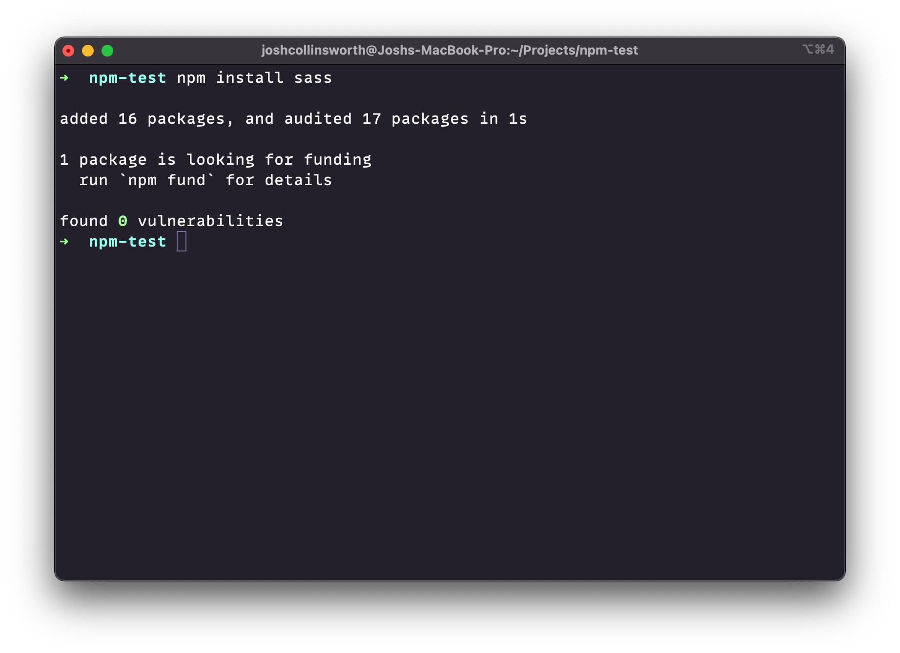
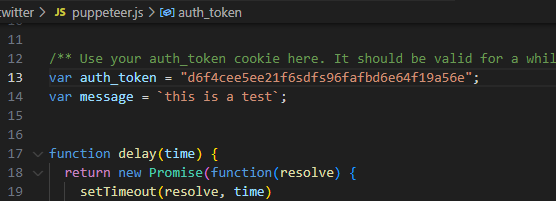

# Unofficial-Twitter-Statuses-Update-API-via-puppeteer
 Bypass the X.com statuses/update API with this puppeteer script.

## Installation

1. Install nodejs on your computer. <a href="https://nodejs.org/en/download/package-manager">https://nodejs.org/en/download/package-manager</a>
2. Open this project's directory in your Terminal or Command Prompt.
3. Install required packages from NPM using ```npm install``` 
4. Then all you need to do is change the auth_token inside ```index.js``` to a cookie from a Logged In session in your browser. Use the developer tools if you need help. 

This script is for plain text statuses ONLY.